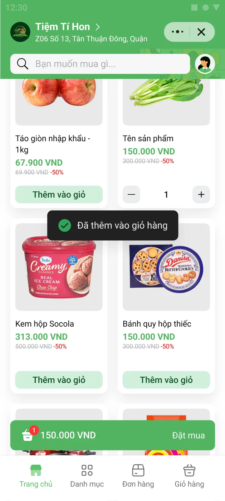
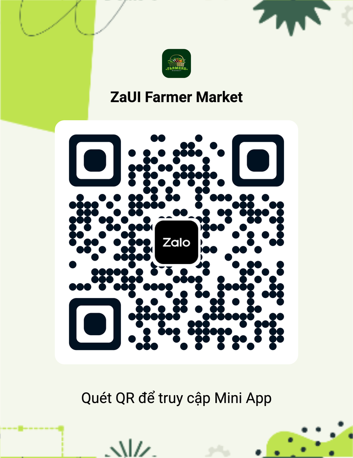
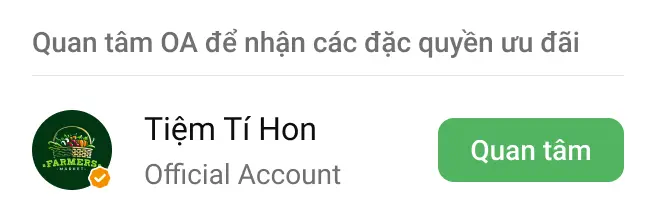
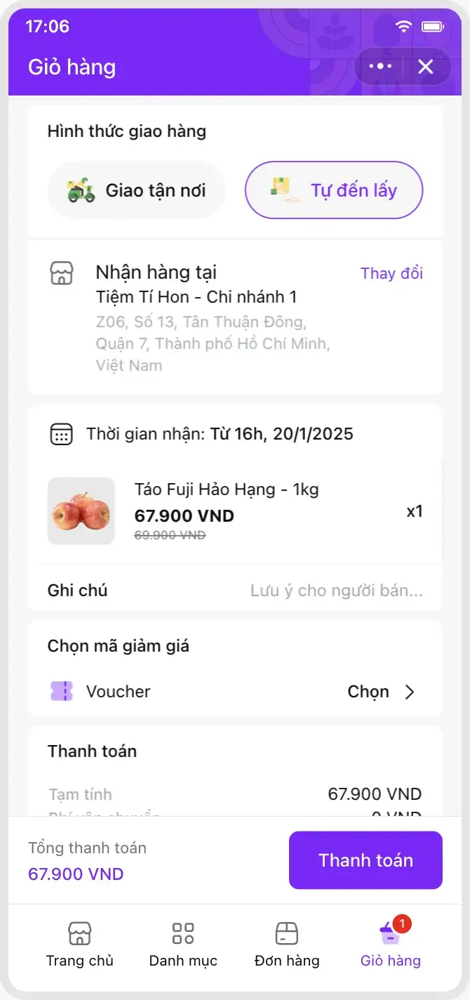

# ZaUI Market

<p style="display: flex; flex-wrap: wrap; gap: 4px">
  
  
  
  
  
  
</p>

A template for vendors to sale their products on the online market. It provides full features such as product viewing, shopping cart, payment, order management, profile management, etc.

|                      Demo                       |                  Entrypoint                  |
| :---------------------------------------------: | :------------------------------------------: |
|  |  |

## Setup

### Using Zalo Mini App Extension

1. Install [Visual Studio Code](https://code.visualstudio.com/download) and [Zalo Mini App Extension](https://mini.zalo.me/docs/dev-tools).
1. Click on **Create Project** > Choose **ZaUI Market** template > Wait until the generated project is ready.
1. **Configure App ID** and **Install Dependencies**, then navigate to the **Run** panel > **Start** to develop your Mini App 🚀

### Using Zalo Mini App CLI

1. [Install Node JS](https://nodejs.org/en/download/).
1. [Install Zalo Mini App CLI](https://mini.zalo.me/docs/dev-tools/cli/intro/).
1. **Download** or **clone** this repository.
1. **Install dependencies**:
   ```bash
   npm install
   ```
1. **Start** the dev server using `zmp-cli`:
   ```bash
   zmp start
   ```
1. **Open** `localhost:3000` in your browser and start coding 🔥

### Using Zalo Mini App Studio

This template is built using **Vite 5.x**, which is **not compatible** with Zalo Mini App Studio.

## Deployment

1. **Create** a Zalo Mini App ID. For instructions, please refer to the [Coffee Shop Tutorial](https://mini.zalo.me/tutorial/coffee-shop/step-1/).

1. **Deploy** your mini program to Zalo using the ID created.

   If you’re using Zalo Mini App Extension: navigate to the Deploy panel > Login > Deploy.

   If you’re using `zmp-cli`:

   ```bash
   zmp login
   zmp deploy
   ```

1. Scan the **QR code** using Zalo to preview your mini program.

## Usage:

The repository contains sample UI components for building your application. You may [integrate your APIs](#load-data-from-your-server) to load categories, products, and process orders. You may also modify the code to suit your business needs.

Folder structure:

- **`src`**: Contains all the logic source code of your Mini App. Inside the `src` folder:

  - **`components`**: Reusable components written in React.js.
  - **`css`**: Stylesheets; pre-processors are also supported.
  - **`mock`**: Example data as json files.
  - **`pages`**: A Page is a React component registered in the router that represents a full view. Smaller sections within the page can be components for better maintainability, though they don’t necessarily need to be reusable.
  - **`static`**: Static assets to be deployed along with your Mini App. Notice: large static assets should be served from a CDN.
  - **`utils`**: Reusable utility functions, such as API integration, client-side cart management, formatting, etc.
  - **`app.ts`**: Root component of your entire Mini App. React DOM will mount this component to the element `#app`.
  - **`global.d.ts`**: Contains TypeScript declarations for third-party modules and global objects.
  - **`hooks.ts`**: Custom utility hooks.
  - **`router.ts`**: Router configuration. New pages should be registered here.
  - **`state.ts`**: Global state management. Jotai is used for simplicity and performance.
  - **`types.d.ts`**: TypeScript declarations for business related objects.

- **`app-config.json`**: [Zalo Mini App Configuration](https://mini.zalo.me/documents/intro/getting-started/app-config/).

The other files (such as `tailwind.config.js`, `vite.config.mts`, `tsconfig.json`, `postcss.config.js`, `.eslintrc.js`, and `.prettierrc`) are configurations for libraries used in your application. Visit the library's documentation to learn how to use them.

## Recipes

### Load data from your server

1. In `app-config.json`, set `template.apiUrl` to your API URL.
   ```json
   "template": {
      "apiUrl": "https://my-server.com/api/", // Set this to your API URL
   }
   ```
1. Your server should implement the following APIs:
   - `GET  /categories`: Retrieve a list of categories.
   - `GET  /products`: Retrieve a list of products.
   - `GET  /banners`: Retrieve a list of banner images to display on the home page.
   - `GET  /stations`: Retrieve a list of pickup stations.
   - `GET  /orders`: Retrieve a list of orders the user has placed.
   - `POST /authenticate`: Authenticate user with Zalo access token and return JWT token (see below).

> Refer to the `src/mock/*.json` files for sample data and structure.

> You may wish to add more APIs to support your business needs. For authorization required APIs, the user's identity can be retrieved from the `Authorization: Bearer ${JWT_TOKEN}` header sent along with each API request. Visit the [Login with Zalo](https://mini.zalo.me/intro/authen-user/) documentation for more detailed instructions.

### Authentication with Backend Server

This template now supports backend authentication integration. When a user opens the mini app, it will:

1. Get the Zalo access token from the Zalo SDK
2. Send the access token to your backend server at `POST /authenticate`
3. Your server validates the access token with Zalo API and returns user information + JWT token
4. The JWT token is stored and automatically included in subsequent API requests

#### Backend Authentication Endpoint

Your server should implement the following endpoint:

**POST /authenticate**

Request body:
```json
{
  "access_token": "string"
}
```

Response format:
```json
{
  "error": false,
  "message": "Authentication successful",
  "data": {
    "token": "jwt_token_here",
    "user": {
      "id": 1,
      "name": "User Name",
      "email": "user@example.com",
      "profile": "https://avatar-url.com/avatar.jpg",
      "mobile": "0912345678"
    }
  }
}
```

#### Laravel Backend Example

Here's a sample Laravel controller implementation:

```php
public function authenticate(Request $request)
{
    $request->validate([
        'access_token' => 'required|string',
    ]);

    $accessToken = $request->access_token;

    try {
        // Call Zalo Open API to get user profile
        $response = Http::withHeaders([
            'access_token' => $accessToken,
        ])->get(config('services.zalo.api_base_url') . '/v2.0/me');

        if (!$response->successful()) {
            return response()->json([
                'error' => true,
                'message' => 'Failed to get user profile from Zalo'
            ], 400);
        }

        $zaloProfile = $response->json();

        if (!isset($zaloProfile['id'])) {
            return response()->json([
                'error' => true,
                'message' => 'Invalid Zalo profile response'
            ], 400);
        }

        // Find or create customer based on Zalo ID
        $customer = Customer::where('firebase_id', $zaloProfile['id'])->first();

        if (!$customer) {
            // Create new customer
            $customer = Customer::create([
                'name' => $zaloProfile['name'] ?? 'Zalo User',
                'email' => isset($zaloProfile['id']) ? $zaloProfile['id'] . '@zalo.user' : null,
                'firebase_id' => $zaloProfile['id'],
                'mobile' => null,
                'profile' => null,
                'address' => null,
                'fcm_id' => null,
                'logintype' => 'zalo',
                'isActive' => 1,
            ]);
        }

        // Generate JWT token
        $token = JWTAuth::fromUser($customer);

        return response()->json([
            'error' => false,
            'message' => 'Authentication successful',
            'data' => [
                'token' => $token,
                'user' => [
                    'id' => $customer->id,
                    'name' => $customer->name,
                    'email' => $customer->email,
                    'profile' => $customer->profile,
                    'mobile' => $customer->mobile,
                ]
            ]
        ]);

    } catch (\Exception $e) {
        return response()->json([
            'error' => true,
            'message' => 'Authentication failed: ' . $e->getMessage()
        ], 500);
    }
}
```

#### How It Works

1. **User opens mini app**: The app automatically calls `getAccessToken()` from Zalo SDK
2. **Sends to backend**: The access token is sent to `POST /authenticate` endpoint
3. **Backend validates**: Your server validates the token with Zalo API and gets user profile
4. **Returns JWT**: Server returns a JWT token along with user information
5. **Stores JWT**: The mini app stores the JWT token in localStorage
6. **Authenticated requests**: All subsequent API requests automatically include the JWT token in the `Authorization: Bearer ${token}` header

#### Fallback Behavior

If the backend authentication fails or is unavailable, the app will fall back to using the local Zalo SDK authentication method to ensure the user can still use the app.

### Link Official Account

The template contains a follow OA widget:

| Feature             | Demo                                        | Configuration                                                                                                                                                                                                                                                               |
| ------------------- | ------------------------------------------- | --------------------------------------------------------------------------------------------------------------------------------------------------------------------------------------------------------------------------------------------------------------------------- |
| Follow OA widget    |    | Follow the instructions to [authenticate your Mini App via Zalo OA](https://mini.zalo.me/documents/pages/thong-bao-huong-dan-xac-thuc-mini-app/). For more information, please refer to the [showOAWidget](https://mini.zalo.me/documents/api/showOAWidget/) documentation. |

### Customize theme



Adjust CSS variables in `src/css/tailwind.scss` as needed to fit your desired branding.

```css
:root {
  --primary: #8420ff;
  --zaui-light-button-secondary-background: #e3b2f1;
  --zaui-light-button-secondary-text: #590872;
}
```